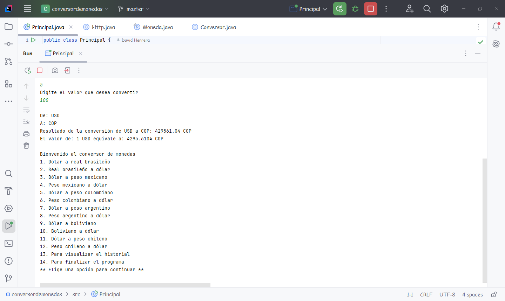
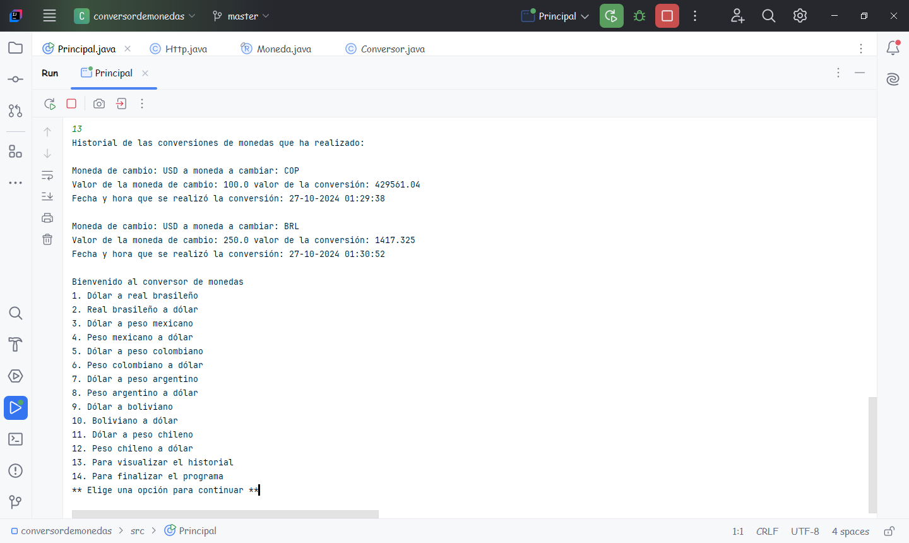

# Conversor de Monedas

## Tabla de Contenidos
- [Descripción](#descripción)
- [Funcionalidad](#funcionalidad)
- [Uso](#uso)
- [Screenshot](#screenshot)

### Descripción
- *Este proyecto fue hecho en IntelliJ IDEA con el lenguaje de programación de Java y hace parte de un desafío planteado en el curso de "Java Orientado a Objetos" de #AluraLatam y #oraclenexteducation*

### Funcionalidad
- Este aplicativo sirve para hacer conversiones entre monedas de algunos paises como:

1. USD => Estados Unidos
2. BRL => Brasil
3. MXN => México
4. COP => Colombia
5. ARS => Argentina
6. BOB => Bolivia
7. CLP => Chile

### Uso
a. Se le presenta al usuario el siguiente menú:

   Bienvenido al conversor de monedas
   1. Dólar a real brasileño
   2. Real brasileño a dólar
   3. Dólar a peso mexicano
   4. Peso mexicano a dólar
   5. Dólar a peso colombiano
   6. Peso colombiano a dólar
   7. Dólar a peso argentino
   8. Peso argentino a dólar
   9. Dólar a boliviano
   10. Boliviano a dólar
   11. Dólar a peso chileno
   12. Peso chileno a dólar
   13. Para visualizar el historial
   14. Para finalizar el programa
   **Elige una opción para continuar**

b. El usuario puede escoger cualquiera de las opciones disponibles ingresando el número (1-14).

c. Luego debe digitar el valor de dinero que desea convertir.

d. El usuario puede consultar el historial digitando la opción (13) o finalizar la aplicación con la opción (14).

### Screenshot

